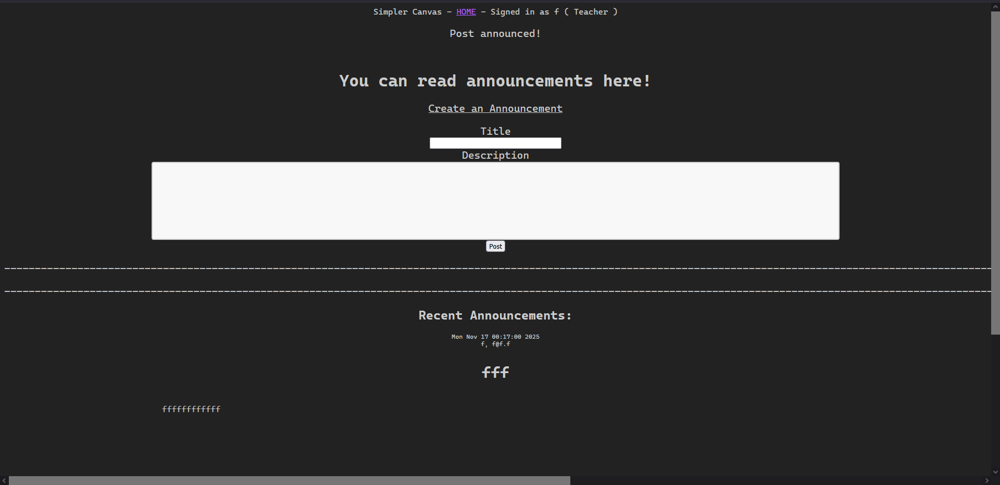
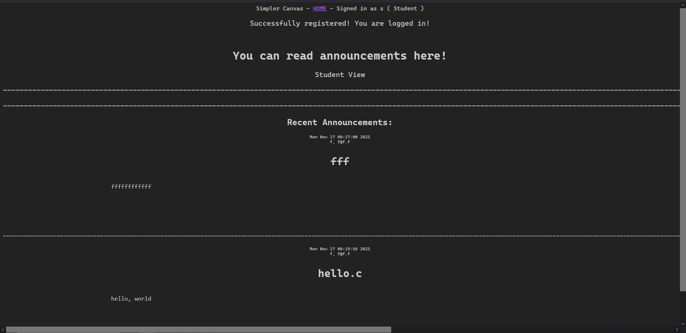

# M3 - Set Up Instructions
Run the command "git clone https://github.com/KhankNyo/BetterCanvas" in your terminal
then cd into BetterCanvas directory. 
Run the file run.py using python3 run.py in your terminal. Put in the link "http://127.0.0.1:5000/logout" in your browser. 
### IMPORTANT: Make sure you are logged out on our website and have cleared cache or any cookies (esp if you have been on it before and was logged in)! Changes to the database were made.
Then, to access different parts of the website, please log in or register an account. Teacher and student accounts see different things on the website. 

If you do not wish to register, input "ProfessorAdam" into the username and "password123" for the password (without the quotes, case-sensitive). 
This logs you into a premade teacher account. The rest of the accounts found in the /people tab also have the password "password123" as well. 
If this does not work, please register a new account. 

> Here is a screenshot from an example runtime after logging in as a teacher:

> Here is a screenshot after logging in as a student:

# Test Instructions: 
From the BetterCanvas directory, cd to the test directory in the terminal using "cd app/tests" (without the quotes). 
### IMPORTANT: running this test will completely wipe the database. 
When in the right directory, make sure you have pytest downloaded, and simply input "pytest" into the terminal. 
All the tests in the folder should run. 

# Team Roles
- Bryan: Made models, forms and routes + most of the html. Back end 
- Khanh: Created and organized files, decorated + formatted. Front end
- Janet: Implemented login/logout with database. Wrote use cases and test cases. Documentor
